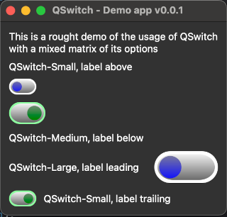

# ch.kimhauser.python.helper
Python3 / PyQt6 UI widgets / extensions, helper classes and functions

## Introduction
This git repo is basically a bunch of python 3 and PyQt6 extensions i wrote while developing a GUI wrapper app named [**pymd3GUI**](https://github.com/jetedonner/pymd3GUI) for the CLI python project [**pymobiledevice3**](https://github.com/doronz88/pymobiledevice3)


## UI Widgets
### QSwitch


QSwitch is a checkbox like GUI widget presented as a togglable switch knob. This is a new Python 3 / PyQt6 Widget. The widget aims to follow the PyQt6 coding guidelines and has - beside PyQt6 - no dependensies. The drawing of the switch is completely done with PyQt6 functionality

#### Sizes
The QSwitch widget has 3 predefined size constants to control the presentation size of the widget. The Size has to be defined on init of the widget and cannot be changed durring runtime.
```
class SwitchSize(Enum):
	Small = 1
	Medium = 2
	Large = 3
```

#### Label position
The QSwitch widget has 4 predefined position constants to control the location for the QLabel relative to the switch widget. The position has to be defined on init of the widget and cannot be changed durring runtime.
```
class SwitchLabelPos(Enum):
	Leading = 1
	Trailing = 2
	Above = 3
	Below = 4
```


### QTextEditHEXSplitter